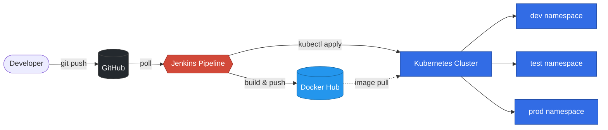
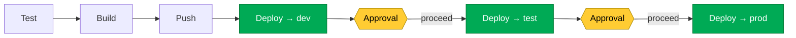

# Automated Deployment Pipeline


A parameterized Jenkins pipeline that takes a Node.js app from a `git push` to running pods in Kubernetes — across dev, test, and prod environments with approval gates between them.

## Architecture



## Promotion flow



## Features

- **Automatic build on every commit** — Jenkins polls GitHub every 2 minutes
- **Five-stage pipeline** — Checkout, Test, Build, Push, Deploy
- **Immutable image tags** — every build tagged with `BUILD_NUMBER` for traceability and rollback
- **Multi-environment promotion** — single artifact flows through dev → test → prod with manual approval gates between each
- **Auto-rollback on failure** — `kubectl rollout undo` reverts the cluster if a deploy fails
- **Auto-create namespaces** — target namespace is created on first deploy if missing
- **Retries on transient failures** — push stage retries twice on network errors
- **Pipeline timeout** — builds abort after 15 minutes to free executors
- **Parameterized pipeline** — image, deployment, namespace, and credential IDs are all overridable, so the same Jenkinsfile works for any repo or cluster
- **Secret management** — Docker Hub PAT and kubeconfig live in Jenkins' credentials store, never in the repo or logs
- **Health probes + resource limits** — readiness gate on `/health`, CPU/memory caps to prevent runaway pods
- **Zero-downtime rolling updates** — 2 replicas, K8s rolling-update strategy

## Repository layout

```
.
├── app.js                  # Node.js HTTP server (demo workload)
├── test.js                 # Black-box HTTP tests
├── Dockerfile              # Container build (node:18-alpine)
├── k8s/deployment.yaml     # Deployment + NodePort Service
├── Jenkinsfile             # Pipeline definition
├── SETUP.md                # Setup walkthrough
└── README.md               # This file
```

## Pipeline stages

| # | Stage | What it does |
|---|---|---|
| 1 | Checkout | Clone the repo at the triggering commit |
| 2 | Test | Run `npm test` |
| 3 | Build | `docker build` with `BUILD_NUMBER` and `latest` tags |
| 4 | Push | Authenticate and push both tags to Docker Hub |
| 5 | Prepare manifest | Patch `deployment.yaml` to reference the new image tag |
| 6 | Deploy → dev | Apply manifest in `dev` namespace, wait for rollout |
| 7 | Promote to test? | Pause for manual approval |
| 8 | Deploy → test | Apply manifest in `test` namespace |
| 9 | Promote to prod? | Pause for manual approval |
| 10 | Deploy → prod | Apply manifest in `prod` namespace |

## Tech stack

| Layer | Tool |
|---|---|
| Source control | GitHub |
| CI/CD | Jenkins LTS (declarative Groovy pipeline) |
| Container | Docker |
| Registry | Docker Hub |
| Orchestrator | Kubernetes (Minikube locally; portable to EKS/GKE/AKS) |
| Runtime | Node.js 18 on Alpine Linux |

## Setup

Full walkthrough in **[SETUP.md](SETUP.md)**.

Quick smoke test once everything is configured:

```bash
kubectl port-forward svc/demo-app 8081:80     # in one terminal
curl http://localhost:8081                    # in another
```

## License

[MIT](LICENSE)
