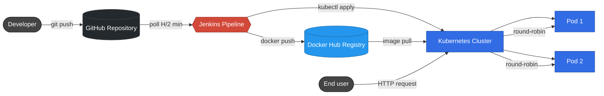
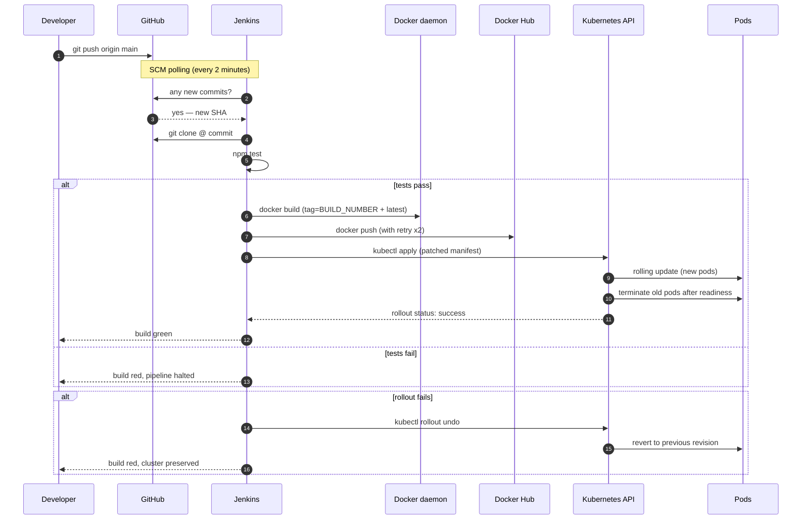

# Automated Deployment Pipeline


A production-grade continuous integration and continuous deployment pipeline that automatically tests, containerizes, publishes, and deploys a Node.js application to a Kubernetes cluster on every Git commit — with auto-rollback on failure, retries on transient errors, and zero manual intervention from commit to running pod.

> Designed as a reusable pipeline: a single parameterized `Jenkinsfile` works for any repository, image, namespace, or cluster — no forks required.

---

## Table of contents

- [Architecture](#architecture)
- [Pipeline flow](#pipeline-flow)
- [Technology stack](#technology-stack)
- [Repository structure](#repository-structure)
- [Pipeline stages](#pipeline-stages)
- [Design decisions](#design-decisions)
- [Security model](#security-model)
- [Reliability features](#reliability-features)
- [Scalability and reuse](#scalability-and-reuse)
- [Getting started](#getting-started)
- [Monitoring strategy](#monitoring-strategy)
- [Roadmap](#roadmap)
- [License](#license)

---

## Architecture

A four-layer system: developer → SCM → CI/CD orchestrator → container orchestrator. The Jenkins layer is the seam between source code and a running cluster.



---

## Pipeline flow

The detailed sequence from `git push` to a running pod:



---

## Technology stack

| Layer | Tool | Version | Why this choice |
|---|---|---|---|
| **Source control** | GitHub | — | Universal, free public hosting, native webhook + Personal Access Token support |
| **CI/CD orchestrator** | Jenkins LTS | 2.555.2 | Self-hostable, plugin-rich, declarative pipeline support, portable across Git hosts |
| **Pipeline definition** | Declarative Jenkinsfile (Groovy) | — | Version-controlled with the app, code-reviewable, parameterized for reuse |
| **Container build** | Docker | 27.3 | Universal container standard; Jenkins builds via mounted host daemon |
| **Image registry** | Docker Hub | — | Free public tier; production would swap for ECR/GCR/Harbor by changing one credential |
| **Container orchestrator** | Kubernetes (Minikube) | v1.35.1 | Same API as managed K8s — pipeline portable to EKS/GKE/AKS by swapping kubeconfig |
| **Application runtime** | Node.js (Alpine) | 18 | Tiny base image (~5MB), fast cold start, matches the demo workload |
| **Triggering** | SCM polling | every 2 min | Works without exposing Jenkins to the internet (webhooks documented as upgrade path) |

---

## Repository structure

```
automated-deployment-pipeline/
├── app.js                      # Node.js HTTP server (the demo workload)
├── test.js                     # Black-box integration tests for / and /health
├── package.json                # Project metadata + npm scripts (test, start)
├── Dockerfile                  # Container build definition (alpine + node 18)
├── .dockerignore               # Excludes dev artifacts from the image
├── .gitignore                  # Standard Node + macOS ignores
├── Jenkinsfile                 # Declarative pipeline (parameterized, with retries + auto-rollback)
├── k8s/
│   └── deployment.yaml         # Kubernetes Deployment (2 replicas) + NodePort Service
├── SETUP.md                    # Complete environment setup walkthrough
├── LICENSE                     # MIT
└── README.md                   # This file
```

---

## Pipeline stages

Each stage in the `Jenkinsfile` has a single responsibility and a defined failure mode.

### 1. Checkout
Clones the repository at the exact commit SHA that triggered the build, ensuring reproducibility.

### 2. Test
Runs `npm test`, executing black-box HTTP tests against the application's `/` and `/health` endpoints. **A failing test stops the pipeline immediately** — no image is built from broken code.

### 3. Build
Builds the Docker image and tags it with two identifiers:
- `:${BUILD_NUMBER}` — immutable, traceable, pinnable for rollback
- `:latest` — convenience pointer for ad-hoc pulls

### 4. Push
Authenticates with Docker Hub using a Personal Access Token (stored in Jenkins credentials, masked from build logs by `withCredentials`). Pushes both tags. Wrapped in `retry(2)` to absorb transient network failures common with registry uploads.

### 5. Deploy
Patches the Kubernetes manifest to reference the new build's image tag, applies it to the target namespace, and waits for the rollout to complete (`kubectl rollout status` with 120 s timeout).

**Failure handling:** if the rollout does not complete successfully (pods crashloop, image fails to pull, readiness probes never succeed), the pipeline automatically issues `kubectl rollout undo` to restore the previous revision. The cluster is never left in a partially-deployed state.

### Post-build
A `post` block runs unconditionally:
- `success` → logs the deployed image and namespace
- `failure` → records the failed build for review
- `always` → `docker logout` to prevent stale credentials in the workspace

---

## Design decisions

### Why Jenkins over GitHub Actions?
GitHub Actions is easier for a project that lives on GitHub — but Jenkins is portable to **any** Git host (GitLab, Bitbucket, self-hosted). It also offers a richer plugin ecosystem (Slack notifications, OIDC for cloud credentials, custom shared libraries) that scales to enterprise contexts.

### Why polling instead of webhooks?
Jenkins runs on `localhost` for this project, so GitHub cannot reach it. Polling every 2 minutes is a pragmatic alternative. In a production deployment behind a public hostname or ingress, GitHub webhooks are strictly better (sub-second latency, no wasted poll cycles).

### Why tag images with `${BUILD_NUMBER}`?
Tagging only with `:latest` makes rollback impossible — the tag is mutable, so you can never reliably revert to a known-good image. Build-number tags give every image an immutable identity that survives in Docker Hub history, allowing precise rollback to any prior build.

### Why auto-rollback on rollout failure?
A CI/CD pipeline should either move the cluster forward or leave it alone — never strand it in a half-broken state. `kubectl rollout undo` is the K8s primitive for this; embedding it into the pipeline's failure path means a broken deployment self-heals.

### Why parameterize the Jenkinsfile?
The "scalability and adaptability" requirement of any real CI/CD system. With image name, deployment name, namespace, and credential IDs as parameters, **the same Jenkinsfile drives pipelines for any number of services** — no fork required. Onboarding a new repo becomes a 5-field Jenkins job config, not a code change.

### Why NodePort over Ingress?
NodePort is sufficient and explicit for local Minikube. In production, this would be an Ingress with TLS termination (cert-manager + Let's Encrypt) or a cloud LoadBalancer fronted by a WAF.

### Why no Helm chart?
For a single application with a single environment, raw YAML is more explicit and easier to reason about. Helm becomes valuable when templating across many environments or packaging the app for redistribution — both listed in the [Roadmap](#roadmap).

---

## Security model

| Concern | Mitigation |
|---|---|
| **Credentials in source** | All secrets (Docker Hub PAT, kubeconfig) stored in Jenkins' credential manager — never in the repository or build logs |
| **Credential exposure in logs** | `withCredentials` automatically masks secret values in Jenkins console output |
| **Authentication tokens** | Docker Hub uses a scoped Personal Access Token (revocable, permission-limited) instead of an account password |
| **Container blast radius** | Resource requests and limits constrain CPU + memory per pod, preventing one bad workload from starving its neighbors |
| **Attack surface** | Alpine Linux base image (~5MB) minimizes the included tooling that could be exploited |
| **Privilege escalation** | Application container runs as the default non-root `node` user from the official Node image |
| **Image integrity** | Build-number tagging plus image digest pinning (roadmap) enables verifiable deploys |

---

## Reliability features

| Feature | Implementation | Failure mode it addresses |
|---|---|---|
| **Pipeline timeout** | `options { timeout(time: 15, unit: 'MINUTES') }` | Hung stages eventually abort instead of blocking executors |
| **Push retries** | `retry(2)` around the `Push` stage | Transient Docker Hub or network errors |
| **Rollout wait** | `kubectl rollout status --timeout=120s` | Deploy reports success only after pods are healthy |
| **Auto-rollback** | `try/catch` in Deploy → `kubectl rollout undo` | Failed deploys self-heal back to last good revision |
| **Build log retention** | `buildDiscarder(logRotator(numToKeepStr: '20'))` | Prevents disk exhaustion from accumulating logs |
| **Timestamped logs** | `timestamps()` option | Enables performance debugging from console output |
| **Readiness probes** | HTTP `GET /health` in `deployment.yaml` | Traffic only routes to pods that have started up |
| **2 replicas + rolling update** | K8s `Deployment` defaults | Zero-downtime deployments; service stays available during rollout |

---

## Scalability and reuse

The pipeline is designed to scale across multiple repositories and multiple Kubernetes clusters **without modifying the Jenkinsfile**.

### Onboarding a new repository

1. Copy `Jenkinsfile` and `k8s/deployment.yaml` to the new repo
2. Create a Jenkins Pipeline job pointing at the new Git URL
3. Override pipeline parameters when triggering the build:
   - `IMAGE_NAME` → the new image identifier (e.g. `myorg/payments-api`)
   - `DEPLOYMENT_NAME` → the K8s Deployment name in your manifest
   - `NAMESPACE` → target namespace
   - `KUBECONFIG_CRED` / `DOCKERHUB_CRED` → existing credentials in Jenkins

### Onboarding a new Kubernetes cluster

1. Generate a kubeconfig for the new cluster (`aws eks update-kubeconfig`, `gcloud container clusters get-credentials`, etc.)
2. Add it to Jenkins as a **Secret file** credential with a descriptive ID (e.g. `eks-staging-kubeconfig`)
3. Reference it via the `KUBECONFIG_CRED` parameter when triggering builds

This separation of pipeline logic (in `Jenkinsfile`) from deployment targets (in credentials) is what makes the pipeline truly reusable.

---

## Getting started

The full step-by-step walkthrough — installing every dependency, configuring Jenkins, generating credentials, and wiring everything together — is in **[SETUP.md](SETUP.md)**.

**Quick smoke test once everything is configured:**

```bash
# Terminal 1 — open a tunnel to the deployed service
kubectl port-forward svc/demo-app 8081:80

# Terminal 2 — hit the running app
curl http://localhost:8081
# → Hello from CI/CD pipeline! Version 2.2.0
# → Served by: demo-app-766576fb6d-52lbb
```

Then make a change, commit, and push:

```bash
git commit -am "trigger redeploy"
git push
# Wait ~2 minutes (SCM polling), then watch Jenkins build #N appear automatically
# Within ~60 seconds of the build starting, a new pod hash will serve traffic
```

---

## Monitoring strategy

Observability spans three layers — **pipeline**, **application**, and **cluster** — each with what exists today and what should be added in a production deployment.

### What exists today

| Layer | Signal | Source |
|---|---|---|
| Pipeline | Build outcome, duration, console logs | Jenkins UI — `Build History` panel and per-build `Console Output` |
| Pipeline | Stage-level timing | Jenkins `timestamps()` option (enabled) prefixes every log line |
| Pipeline | Last 20 builds retained | `buildDiscarder` option prevents disk exhaustion |
| Application | Health endpoint | `GET /health` returns `{"status":"ok"}` — wired to K8s readiness probe |
| Cluster | Pod and deployment state | `kubectl get pods`, `kubectl rollout status`, `kubectl describe` |
| Cluster | Container logs | `kubectl logs <pod>` (ephemeral, lost on pod termination) |
| Cluster | Cluster events | `kubectl get events` (rolling 1-hour window by default) |

### Recommended additions for production

| Concern | Tool | Why |
|---|---|---|
| **Build success rate, MTTR, deploy frequency** | Jenkins → Prometheus exporter + Grafana dashboard | DORA metrics; quantifies pipeline health |
| **Real-time build notifications** | Slack/Teams via `post` block in Jenkinsfile | Surface failures to the team without polling Jenkins |
| **Application metrics** | Prometheus client in `app.js` exposing `/metrics` | Request rate, latency, error rate — the RED method |
| **Log aggregation** | Fluent Bit → Loki / Elasticsearch / Datadog | Pod logs survive pod death; full-text search across replicas |
| **Cluster events stream** | `kubectl events --watch` or Argo Events | Catch `ImagePullBackOff`, `OOMKilled`, etc. as they happen |
| **Alerting** | Prometheus Alertmanager → PagerDuty / Opsgenie | Page on: build failure rate > X%, p99 latency > Y, replica count < N |
| **Distributed tracing** | OpenTelemetry SDK in `app.js` → Tempo / Jaeger | Trace a request through future microservice boundaries |
| **Cost monitoring** | OpenCost / Kubecost | Per-namespace cost attribution at scale |

### Health check architecture

The `/health` endpoint is intentionally simple — `200 OK` if the process is running. It's used by two probes:

1. **Kubernetes readinessProbe** (every 5 s) — gates traffic. If `/health` returns non-200, K8s removes the pod from the Service endpoints until it recovers.
2. **CI/CD smoke test** (in `npm test`) — runs as part of the `Test` stage, catches regressions before an image is built.

A future enhancement would add a `/ready` endpoint that checks downstream dependencies (database, cache, downstream APIs) and only returns 200 once they're all reachable.

---

## Roadmap

Concrete next steps, ordered by impact:

| Priority | Improvement | Why it matters |
|---|---|---|
| High | Replace SCM polling with GitHub webhooks | Sub-second trigger latency instead of up to 2 minutes |
| High | Add Slack notifications via `post` block | Real-time visibility for the team |
| High | Multi-environment promotion (dev → staging → prod via namespaces) | Reflects real-world release flow |
| Medium | Trivy image scanning before push | Catches known CVEs before they hit the registry |
| Medium | Migrate raw YAML to a Helm chart | Templates differ per environment without code duplication |
| Medium | Pin images by digest (`@sha256:…`) in production | Eliminates the `:latest` tag drift entirely |
| Low | GitOps-style deploy via ArgoCD (pull instead of push) | Industry direction for K8s deploys |
| Low | Prometheus metrics endpoint in the demo app | Adds real observability beyond logs |
| Low | A Jenkins Shared Library extracting the pipeline | One source of truth for many repos |

---

## License

[MIT](LICENSE) — see the LICENSE file for the full text.
